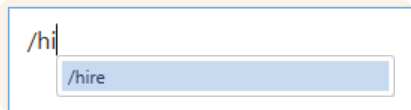
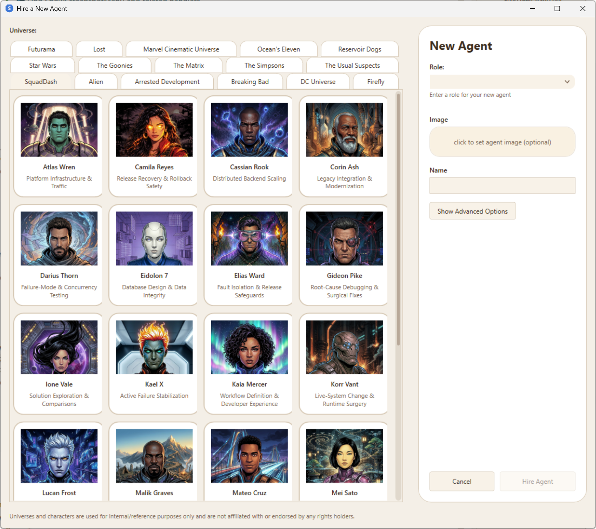

# Hiring Agents

**Hiring** is how you add a new specialist to your workspace's Squad team. A hired agent gets a name, a role, a `charter.md` defining its responsibilities, and a `history.md` for accumulated context. Once hired, the agent appears in the SquadDash sidebar and the coordinator can route prompts to it automatically.

---

## Invoking `/hire`

Type `/hire` in the prompt box and press **Enter** (or **Tab** if auto-fill is up).



The **Hire a New Agent** dialog opens immediately — no AI turn is consumed at this point.

> **Tip:** `/hire` can be invoked even while a prompt is running. SquadDash will hold the hire submission until the current turn finishes.

---

## The Hire Agent Dialog

The dialog is divided into two areas: a **universe and character gallery** on the left and a **new agent** configuration form on the right.



### Universe Tabs

At the top of the gallery, tabs represent available **universes** — curated sets of agent templates. The active tab defaults to the universe your workspace most recently used.

Selecting a tab switches the gallery to that universe's available agents.

### Template Cards

Each card in the gallery represents a pre-defined agent template with a name, role, and optional avatar image. Click a card to populate the form fields on the right.

- Right-click a card to **set a custom image** for that template.
- If you switch cards after editing the form, SquadDash asks whether to replace your changes.
- To start from scratch without picking a template, click **Create Custom Agent** (appears below the gallery).

### Agent Configuration Form

| Field | Required | Description |
|---|---|---|
| **Name** | Yes | The agent's handle (e.g., `nova-chen`). Must not conflict with an existing team member. |
| **Role** | Yes | Chosen from a dropdown of common roles (e.g., *Backend Engineer*, *Testing / QA Specialist*, *Documentation Specialist*) or typed manually. |
| **Best For** | Optional | Bulleted list — task types this agent excels at. Used to populate `charter.md`. |
| **Avoid** | Optional | Bulleted list — task types to route away from this agent. |
| **What I Own** | Optional | Bulleted list — files, modules, or domains this agent is the primary owner of. |
| **Avatar** | Optional | Click the image preview area to select a PNG/JPG/WEBP image for the agent card. |

#### Advanced Options

Click **Advanced Options** to reveal two additional fields:

| Field | Description |
|---|---|
| **Model Preference** | Suggest a specific AI model for this agent (e.g., `claude-sonnet-4`). The coordinator honors this as a preference, not a hard constraint. |
| **Extra Guidance** | Free-form instructions appended to the hire prompt — use this for anything not covered by the structured fields. |

---

## Confirming the Hire

Click **Hire** to submit. SquadDash constructs a coordinator prompt from your inputs and sends it to the AI team:

```
Hire a new team member for this workspace.

Preferred universe: SquadDash
Preferred name: nova-chen
Role: Backend Engineer

Best For:
- REST API design
- Database migrations

Use Squad's standard add-member workflow so the new hire is created correctly.
Generate or refine a high-quality charter.md and history.md for the new agent.
Update .squad/team.md, .squad/routing.md, and .squad/casting/registry.json.
```

The coordinator (or a delegated agent) then:

1. Creates `.squad/agents/<name>/charter.md` and `history.md`.
2. Adds the agent to `.squad/team.md` and `.squad/routing.md`.
3. Registers the agent in `.squad/casting/registry.json`.

If the requested name conflicts with an existing team member, the coordinator stops and asks for direction before making any changes.

---

## After Hiring

Once the coordinator confirms the hire, the new agent card appears in the SquadDash sidebar. The coordinator can begin routing prompts to the new specialist immediately.


> 📸 *Screenshot needed: The SquadDash main window after a hire completes — show the new agent card in the sidebar with its name and role visible. If an avatar was set, show the card with the image.*

You can then:

- **Send a prompt directly** — prefix with `@<name>` to address the new agent.
- **Let the coordinator route** — just describe a task; Squad will route to the new specialist when appropriate.
- **Edit the charter** — open `.squad/agents/<name>/charter.md` in your editor to refine responsibilities.

---

## Agent Lifecycle Commands

After hiring, you can manage an agent's status with slash commands:

| Command | Effect |
|---|---|
| `/deactivate <name>` | Removes agent from the active roster; knowledge is preserved |
| `/activate <name>` | Restores an inactive agent to the active roster |
| `/retire <name>` | Archives the agent to `.squad/agents/_alumni/`; preserves name reservation |

See **[Slash Commands](../reference/slash-commands.md#squadDash-ui-commands)** for full details on these lifecycle commands.

---

## Related

- **[Slash Commands](../reference/slash-commands.md)** — Complete reference for all `/` commands
- **[Agents](../concepts/agents.md)** — What agents are, how they're structured, and how SquadDash renders them
- **[Adding an Agent](../contributing/adding-an-agent.md)** — Manual process for defining an agent without the dialog
- **[Squad Team](../concepts/squad-team.md)** — How `team.md` and routing work together
