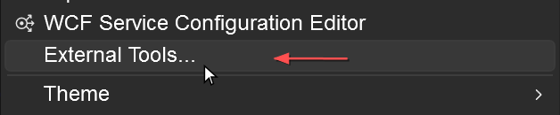
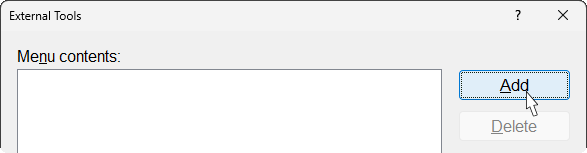
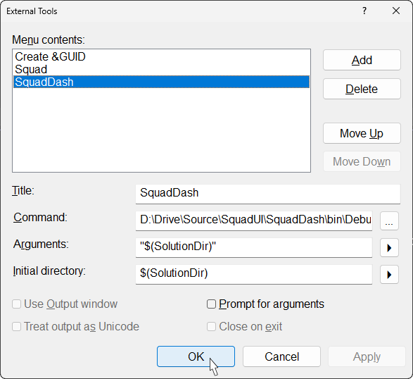

# Access Through Visual Studio

How to configure SquadDash as an **External Tool** in Visual Studio so you can launch it directly from the **Tools** menu while working in VS — automatically passing your solution folder as the workspace path.

---

## What This Does

Once configured, SquadDash appears under **Tools → SquadDash** in Visual Studio. Clicking it launches SquadDash with your current solution folder pre-loaded as the workspace — no folder browsing required.

---

## Step-by-Step Setup

### 1. Open the External Tools Dialog

In Visual Studio, go to **Tools → External Tools…**


---

### 2. Add a New Entry

Click **Add** (the button on the right side of the dialog) to create a new tool entry.


---

### 3. Configure the Entry

Fill in the fields as follows:

| Field | Value | Notes |
|---|---|---|
| **Title** | `SquadDash` | This is the name that appears in the Tools menu |
| **Command** | `C:\...\SquadDash.exe` | Full path to the SquadDash **launcher** executable (see below) |
| **Arguments** | "`$(SolutionDir)`" | Passes the solution folder as the workspace path |
| **Initial directory** | `$(SolutionDir)` | Sets the working directory to the solution folder |

#### Finding SquadDash.exe

> **Important:** Always launch `SquadDash.exe` — the **launcher** — not `SquadDash.App.exe`.
> `SquadDash.App.exe` is the underlying WPF process managed by the launcher's A/B slot system; launching it directly bypasses update management and slot coordination.

After building from source (Debug), the launcher is at:

```
<solution-root>\SquadDash\bin\Debug\net10.0-windows\SquadDash.exe
```

The launcher (`SquadDashLauncher` project, assembly name `SquadDash`) outputs into the same `SquadDash\bin\` folder as the app because its project sets `OutputPath` to that directory. Both `SquadDash.exe` (launcher) and `SquadDash.App.exe` (app) live side-by-side there — use `SquadDash.exe`.

For a published/installed build, use the install location (e.g., `C:\Program Files\SquadDash\SquadDash.exe`) — still `SquadDash.exe`, not `SquadDash.App.exe`.

---

### 4. Save

Click **OK** to save. 



**SquadDash** now appears under the **Tools** menu.

---

## Using It

1. Open your solution in Visual Studio
2. Go to **Tools → SquadDash**
3. SquadDash launches with your solution folder pre-loaded as the workspace

No workspace selection step — SquadDash opens straight to your project's agents and history.

---

## Command-Line Usage

You can also launch SquadDash directly from a terminal, passing the workspace path as an argument:

```cmd
SquadDash.exe "C:\path\to\your\solution"
```

Use `SquadDash.exe` (the launcher), not `SquadDash.App.exe`. This is the same mechanism the VS External Tool uses — passing the solution directory directly to the launcher.

---

## Troubleshooting

| Problem | Fix |
|---|---|
| SquadDash doesn't open | Verify the **Command** path points to a valid `SquadDash.exe` (the launcher, not `SquadDash.App.exe`) |
| Wrong workspace loaded | Check the **Arguments** field — it should be `"$(SolutionDir)"` (with quotes) |
| Node.js error on launch | Ensure `node`, `npm`, and `npx` are on your `PATH` — see [Installation](installation.md) |

---

## Next

- **[First Run](first-run.md)** — What to expect when SquadDash opens
- **[Configuration](../reference/configuration.md)** — Application settings
