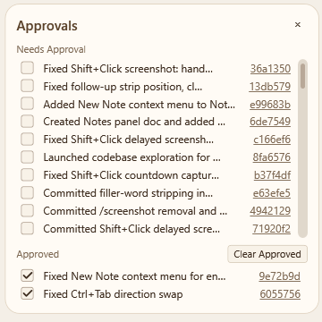

# Approvals Panel

The Approvals Panel provides a running list of every git commit an agent has made during the session. Each entry starts in the **Needs Approval** section; you check it off to move it to **Approved**. The panel lets you review agent commits at your own pace, jump directly to the transcript turn where the commit happened, and open the commit on GitHub — all without leaving SquadDash.

---

## Opening the Panel

**View** menu → **Approvals Panel** (toggles visibility). The menu item has a checkmark when the panel is open. Visibility is persisted per workspace.

Close the panel with its **×** button.

---

## How Entries Are Added

SquadDash populates the panel automatically. When an agent's turn ends with a push notification that contains a git commit SHA, SquadDash:

1. Extracts the short SHA from the notification.
2. Constructs a GitHub URL (`<workspaceGitHubUrl>/commit/<sha>`) when a GitHub remote is configured.
3. Derives a short description (≤ ~10 words) from the notification summary, or falls back to the first 8 words of the original prompt.
4. Adds the entry to **Needs Approval**.

Entries persist across SquadDash restarts (stored in `commit-approvals.json` in the workspace state directory). The store retains the **200 most recent** entries.

---

## Panel Layout



Each row contains:

| Element | Description |
|---|---|
| **Checkbox** | Unchecked = Needs Approval; checked = Approved. Toggling moves the row between sections. |
| **Description** | Short summary derived from the notification or prompt. Click to jump to the transcript turn. |
| **Feature badge** | Colored label showing the item's feature group. Hidden in grouped view (the group header makes it redundant). |
| **SHA link** | First 7 characters of the commit SHA, underlined. Click to open the full commit on GitHub. Only shown when a GitHub remote URL is configured. |

> **Grouped view** reorganizes this layout — items appear under bold feature group headers instead of a single flat list. See [Feature Groups](#feature-groups) below.

---

## Approving a Commit

Check the checkbox next to an entry. The row moves from **Needs Approval** to **Approved** immediately. Uncheck it to move it back.

State is saved to `commit-approvals.json` after every toggle.

---

## Jumping to the Transcript Turn

Click the **description text** of any entry to scroll the coordinator transcript to the prompt that produced that commit. SquadDash switches to the coordinator transcript if another thread is currently selected.

This is useful for reviewing exactly what the agent was asked and what it did before approving.

---

## Clearing Approved Entries

Click **Clear Approved** in the Approved section to remove all approved entries permanently. Only approved entries are removed; pending entries are unaffected.

---

## Feature Groups

Items can be organized into named feature groups and displayed under collapsible section headers.

### Toggling grouped view

Right-click the **panel background** (not a row) to open the panel context menu:

- **"Group by Feature"** — switches to grouped view.
- **"Ungroup by Feature"** — returns to flat view.


📸
> Screenshot needed: right-click context menu on the panel background with "Group by Feature" visible

### Layout in grouped view

- Items are organized under **bold feature group headers**.
- Groups are sorted **alphabetically**, with **Uncategorized always first**.
- Items within each group are sorted **most recent first**.
- The **feature badge** on each row is hidden — the group header already identifies the category.

Both the **Needs Approval** and **Approved** sections display items in grouped layout when grouped view is on.


📸
> Screenshot needed: the full Approvals panel in grouped view, with at least two named groups and an Uncategorized group visible in both Needs Approval and Approved sections

### Filter in grouped view

The filter text box in the panel header works in both flat and grouped view. Typing filters rows within every group simultaneously.

---

## Organizing Items into Groups

### Organize button (🗂)

The **🗂 Organize** button sits in the panel header, to the left of the **×** close button.

Clicking it:

1. Queues an AI prompt asking the AI to categorize all unorganized pending items.
2. Attaches the item list as a **context attachment** (paperclip) — it does not appear inline in the transcript.
3. Passes existing group names to the AI so it can reuse or extend them.

The AI responds with the `organize_approvals` host command, which assigns groups and re-renders the panel.


📸
> Screenshot needed: the panel header area with the 🗂 button visible to the left of ×

### Categorize these… (right-click Uncategorized header)

When in grouped view, right-click the **Uncategorized** group header to see **"Categorize these…"**.

Clicking it sends the same kind of AI prompt as the Organize button, but scoped to only the uncategorized items. This is useful when you want to organize new arrivals without disturbing already-assigned items.

The AI responds with `organize_approvals` — groups are assigned and the panel re-renders.

### Move to category (right-click any row)

In grouped view, right-clicking any **row** shows a **"Move to category"** submenu listing all known feature groups in alphabetical order.

Selecting a group:

1. Reassigns that item to the chosen group.
2. Rebuilds the panel.
3. **Scrolls the item into view and highlights it** in its new group.


📸
> Screenshot needed: right-click context menu on a row in grouped view, with the "Move to category" submenu expanded showing several group names

---

## Group Approval Actions

### Approve all items in a group

Each group header in the **Needs Approval** section has a **checkbox**.

- **Check it** → every item in that group is approved at once. All rows move to the **Approved** section and the group header disappears from Needs Approval.

### Un-approve all items in a group

The Approved section group headers also have checkboxes.

- **Uncheck it** → all items in that group move back to **Needs Approval**. The group header is recreated there automatically.

### Un-approving individual items

Unchecking a single approved row moves it back to Needs Approval:

- If the item's feature group **already has a header** in Needs Approval, the item is inserted under it.
- If not, the **group header is created automatically**.


📸
> Screenshot needed: grouped view Needs Approval section showing a group header with its checkbox, and the same group visible in Approved after checking it

---

## Tips

- The SHA link only appears when `workspaceGitHubUrl` is configured. If you see no SHA links, check your workspace GitHub URL setting in Preferences.
- The panel is per-workspace. Switching workspaces replaces the entry list with that workspace's `commit-approvals.json`.
- Entries survive SquadDash restarts — you can review and approve commits from a previous session.
- If the panel is cluttered, approve everything you've already reviewed and then use **Clear Approved** to reset it.
- Use **Group by Feature** when a session produces many commits across multiple features — it's much easier to approve or skip a whole group at once with the group header checkbox.
- The **🗂 Organize** button is the fastest way to bulk-categorize a large backlog; **Categorize these…** on the Uncategorized header is faster when only new items need labeling.
- After using **Move to category**, the item scrolls into view and is highlighted so you can confirm it landed in the right place.

---

## Follow-up on a Commit

You can reference a specific approval entry when composing your next prompt. This is useful for asking an agent to revisit, explain, or build on top of a specific commit.

**How to attach a follow-up:**

1. Right-click any entry in the **Needs Approval** or **Approved** section.
2. Select **Follow up…**.

A dismissable strip appears above the prompt input (or above the queue tab strip if a queued tab is selected):

```
↩ Follow-up: abc1234 — "Fix agent sort order"   [×]
```

### What happens when you send

The follow-up context is silently prepended to the outgoing prompt — it is not visible in the draft or the conversation history:

```
[Follow-up on abc1234 — "Fix agent sort order": <original prompt summary>]

<your new prompt>
```

The agent receives the full context header and can see what the referenced commit was about. Your message appears in the transcript without the header.

### Clearing a follow-up

Click **×** on the strip to remove the attachment before sending. The draft is unaffected.

### Follow-up with queued prompts

If a follow-up is attached to the **Active Draft** and you queue that prompt while the agent is busy, the attachment travels with the queued item and fires when that item is dispatched. Each queued tab tracks its own follow-up independently.

---

## Related

- **[Loop Panel](Loop.md)** — Commit entries accumulate quickly during loop runs; the approvals panel is the review checkpoint
- **[Transcripts](../concepts/transcripts.md)** — Jump-to-turn lands in the coordinator transcript
- **[Configuration](../reference/configuration.md)** — Setting the workspace GitHub URL
