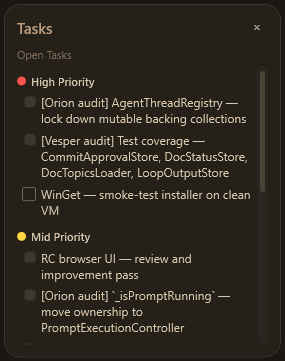

# Tasks Panel

The Tasks Panel is a read-only sidebar that surfaces the open task backlog from `.squad/tasks.md`. It groups tasks by priority so you can see at a glance what needs doing — without leaving SquadDash or opening a separate editor.

---

## Opening the Panel

**View** menu → **Tasks** (toggles visibility). Visibility is persisted per workspace.

Close the panel with its **×** button.

---

## What the Panel Shows

Tasks are read from `.squad/tasks.md` in the workspace's `.squad/` folder and grouped into three priority buckets, always in High → Mid → Low order:


| Emoji | Priority label | Dot colour |
|---|---|---|
| 🔴 | High Priority | Red |
| 🟡 | Mid Priority | Amber |
| 🟢 | Low Priority | Blue (TaskPriorityLow theme colour) |

The panel is **read-only** — checking off tasks requires editing `.squad/tasks.md` directly.

---

## Task Format in `.squad/tasks.md`

Use standard checkbox list format under `##` headings that include a priority emoji:

```markdown
## 🔴 High Priority

- [ ] **Fix login timeout** *(Owner: Arjun Sen)*
  Session tokens expire before the 30-minute idle window.

- [ ] **Resolve flaky CI test**

## 🟡 Mid Priority

- [ ] **Add dark mode toggle** *(Owner: Lyra Morn)*

## �� Low Priority

- [ ] **Update README screenshots**

## ✅ Done

- [x] **Initial scaffolding**
```

### Parsing rules

- Only **open** tasks (`- [ ]`) are shown. Completed tasks (`- [x]`) are ignored.
- The `**bold**` wrapper around the task title is stripped automatically — only the plain title is displayed.
- The `*(Owner: …)*` suffix is stripped; owner information is not shown in the panel.
- Parsing stops when a `##` heading containing `✅` is encountered — everything from that heading onward is ignored. Put your Done section last.
- If the same priority emoji appears in multiple `##` sections (e.g., two `## 🔴` blocks), their items are merged into a single group in the panel.
- Non-priority `##` headings (no emoji match) reset the active group — items below them are not collected until the next priority heading.

---

## Refreshing the Panel

The panel reloads automatically whenever `.squad/tasks.md` changes on disk. You can also trigger a refresh with the `/tasks` slash command in the prompt box.

---

## Tips

- Keep the highest-priority tasks near the top of each section so the most important ones are immediately visible.
- Use `/dropTasks` to clear the cached task context that the squad CLI uses; this does not affect the panel display.
- The panel renders task titles only — put actionable detail in sub-bullets below the task line for agents reading the raw file.

---

## Related

- **[Loop Panel](Loop.md)** — Run agents in a loop to work through the task backlog automatically
- **[Slash Commands](../reference/slash-commands.md)** — `/tasks` and `/dropTasks` commands
