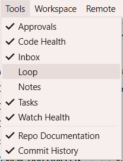
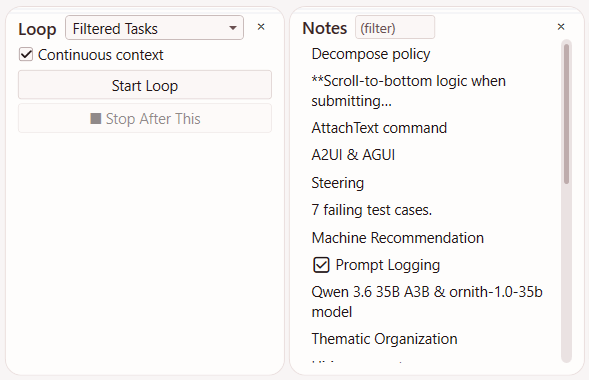
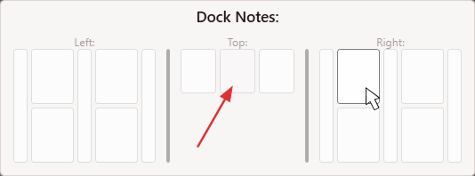

# Using Tools

SquadDash provides a set of tool panels that surface agent activity and workspace information alongside the main transcript. This page explains how to open, close, and arrange tool panels.

## Opening and Closing Panels

All tool panels are accessible from the **Tools** menu in the menu bar. Each menu item toggles the corresponding panel's visibility on and off — selecting it once opens the panel, selecting it again closes it.

You can also close any open panel by clicking its **✕** button in the upper-right corner of the panel itself.

## Docking Panels

Tool panels can be docked inside the main SquadDash window. When you open a panel, it attaches to one of three docking regions in the window surrounding the transcript: left, right, or top (to the right of the inactive agents).

You can rearrange panels by clicking their dock bar at the top and then selecting a new target location for the tool.

For example, if I click the dock bar at the top of the **Notes** panel (when it's already docked in the top), I might see something that looks like this: 

The red arrow points to the starting position for the Notes panel. The dock window contains three docking locations: left, top and right. Hover the mouse over the new target location and click to move the tool panel.

## Persisted Visibility

Panel visibility is saved **per workspace**. If you close SquadDash with the Tasks and Approvals panels open, they will reopen automatically the next time you launch SquadDash in that same workspace. Different workspaces can have different panel configurations.

## Saving and Restoring Tool Layouts
Save tool layouts in the **View** menu. Choose **Save Layout** and then selecting a slot. You can also press **Shift**+**F7** to save the current layout into slot 1. 

Restore layouts from the **View** menu. Choose **Restore Layout** (and select the slot you want to restore). You can also press **F7** to restore the layout from slot 1.
