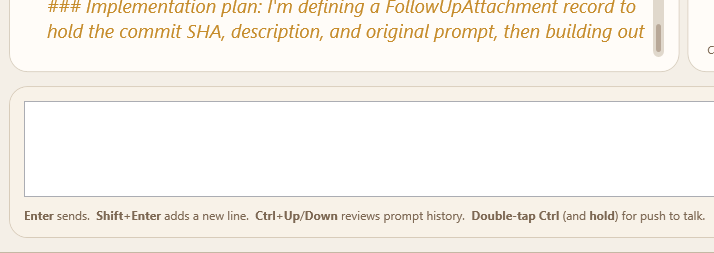

# Slash Commands

Slash commands are shortcuts you type directly into the SquadDash prompt box. Begin any prompt with `/` to trigger IntelliSense autocomplete, then select or finish typing the command and press **Enter** or **Tab** to run it.

Some commands are handled locally by SquadDash (instant, no AI round-trip). Others are forwarded to Squad's AI coordinator, which interprets and executes them as natural-language instructions to your team.

---

## How to Use Slash Commands

1. Click the prompt box (or press any key to focus it).
2. Type `/` — the autocomplete list appears immediately.
3. Continue typing to filter, or use **↑ / ↓** to navigate, then **Tab** or **Enter** to select.
4. Commands that require a parameter (e.g., `/activate`) insert a trailing space so you can type the argument before submitting.

> 📸 *Screenshot needed: The prompt box with "/" typed and the autocomplete dropdown open, showing several slash command options. Capture the full dropdown.*

---

## SquadDash UI Commands

These commands are intercepted locally by SquadDash and execute immediately — no AI turn is consumed. Most can be used **even while a prompt is running**.

| Command | Description | Opens dialog? |
|---|---|---|
| `/activate <name>` | Restore an inactive or retired agent to the active roster | No — delegates to AI |
| `/agents` | List all team members in the transcript | No |
| `/clear` | Clear the transcript (asks for confirmation) | Confirmation prompt |
| `/deactivate <name>` | Remove an agent from the active roster without deleting them | No — delegates to AI |
| `/doctor` | Run Squad Doctor diagnostics | No |
| `/dropTasks` | Hide the live background-tasks popup | No |
| `/help` | Show the built-in command reference in the transcript | No |
| `/hire` | Open the visual hire-agent workflow | **Yes — Hire Agent dialog** |
| `/model` | Show the active AI model in the transcript | No |
| `/retire <name>` | Archive an agent and remove them from the active roster | No — delegates to AI |
| `/screenshot` | Open the screenshot capture overlay | Yes — screenshot overlay |
| `/session` | Manage SDK sessions (sub-commands available — type `/session` for details) | No |
| `/sessions` | List saved sessions in the transcript | No |
| `/status` | Show team, session, and current turn state | No |
| `/tasks` | Show or refresh the live background-tasks popup | No |
| `/trace` | Open the live trace window | Yes — trace window |
| `/version` | Show Squad and SquadDash version in the transcript | No |

### Commands that require a parameter

The following commands accept a required `<name>` argument. When Tab-completed, SquadDash inserts the command with a trailing space and waits for you to type the argument before submitting.

| Command | Argument | Example |
|---|---|---|
| `/activate` | Agent name (partial match accepted) | `/activate lyra` |
| `/deactivate` | Agent name | `/deactivate orion` |
| `/retire` | Agent name | `/retire old-bot` |

---

## Squad AI Commands

These commands are forwarded to Squad's AI coordinator as natural-language instructions. They consume a normal AI turn and are executed by your team's agents.

| Command | Description |
|---|---|
| `/agents` | List all team members (also available as a local command) |
| `/history [N]` | Show the last N messages in context (default: 10) |
| `/nap [--deep]` | Context hygiene — compress, prune, and archive conversation history |
| `/resume <id>` | Restore a past session by ID prefix |
| `/session` | Manage SDK sessions |
| `/sessions` | List saved sessions |
| `/status` | Check your team and what is happening |
| `/version` | Show Squad version |

Additionally, the full IntelliSense list includes Squad CLI pass-through commands such as `/add-dir`, `/allow-all`, `/changelog`, `/context`, `/copy`, `/delegate`, `/diff`, `/experimental`, `/feedback`, `/fleet`, `/ide`, `/init`, `/instructions`, `/login`, `/logout`, `/lsp`, `/mcp`, `/new`, `/plan`, `/pr`, `/research`, `/restart`, `/resume`, `/review`, `/rewind`, `/rename`, `/share`, `/skills`, `/update`, `/usage`. These are forwarded directly to the Squad CLI layer.

---

## Command Behaviour at a Glance

| Behaviour | Commands |
|---|---|
| **Safe while a prompt is running** | `/activate`, `/agents`, `/deactivate`, `/doctor`, `/dropTasks`, `/help`, `/hire`, `/model`, `/retire`, `/screenshot`, `/status`, `/tasks`, `/version` |
| **Opens a dialog or overlay** | `/hire`, `/screenshot`, `/trace`, `/clear` (confirmation) |
| **Requires a `<name>` argument** | `/activate`, `/deactivate`, `/retire` |
| **Forwarded to AI coordinator** | All Squad AI commands + lifecycle commands |

---

## Related

- **[Hiring Agents](../features/hiring-agents.md)** — Step-by-step guide to the `/hire` workflow
- **[Keyboard Shortcuts](keyboard-shortcuts.md)** — Hotkeys for navigation and prompt box control
- **[Routing](routing.md)** — How the AI coordinator chooses which agent handles each prompt
